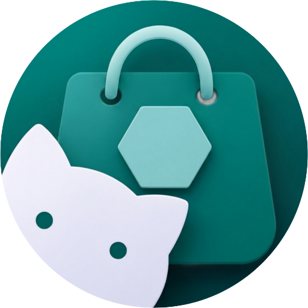
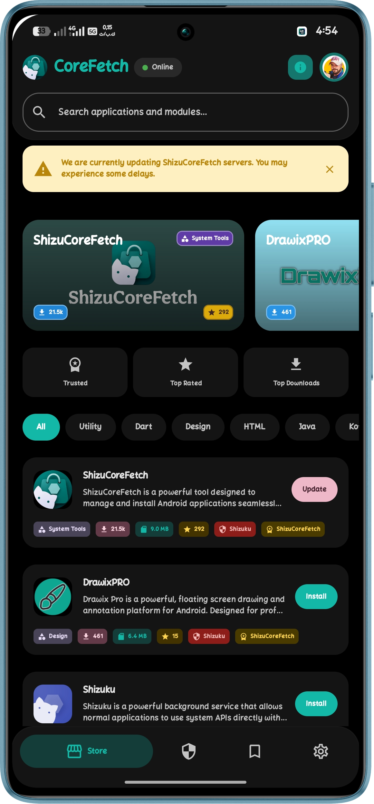
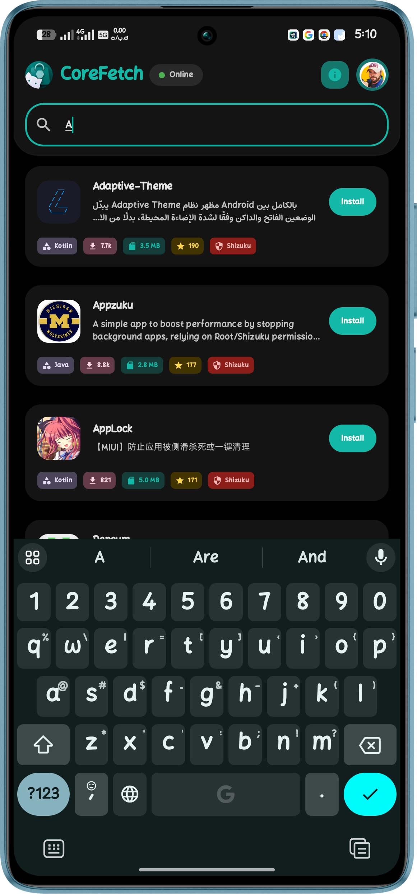
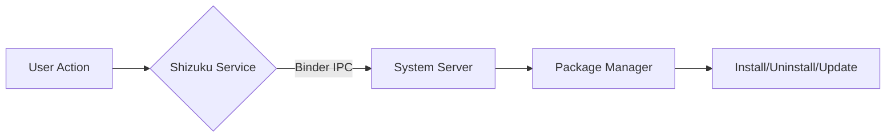

# Shizu CoreFetch

 

 <strong>An advanced, Shizuku-powered application hub for Android.</strong> 
 Fetch, manage, and silently update your apps with system-level privileges — entirely open source.

 
 
 
 
 

📢 **Stay Updated:** [Join our official Telegram Channel](https://t.me/shizucorefetch) for the latest updates, releases, and direct support.

---

## Attention Developers: Stand Out in the Store!

With Shizu CoreFetch rapidly expanding and reaching a large, active user base, now is the perfect time to optimize how your application is presented. Our smart store engine automatically scans for custom metadata. By simply adding a `shizu_store.json` file to the root of your repository, you can display elegant, tailored information, localized descriptions, and custom developer details directly inside the Shizu CoreFetch store. 

While this is entirely optional, organizing your data adds a highly professional and polished touch to your app's listing, making it much more appealing to users. 

*You can find the full documentation and a detailed guide on how to structure your JSON file at the bottom of this README.*

---

## 📖 Overview

**Shizu CoreFetch** is a next‑generation application manager for Android that leverages the **Shizuku** API to perform silent installs, uninstalls, and background updates without requiring root access. Completely rebuilt from the ground up, the latest architecture features a standalone background engine, intelligent device scanning, and a stunning new UI built entirely with Jetpack Compose. 

It comes bundled with a local **APK wallet**, a centralized repository browser, real‑time notifications, and full GitHub integration — all wrapped in a clean, modern interface that supports 11 languages.

> ⚡ Perfect for power users, developers, and anyone tired of manual package management.

---

> ⚠️ **Notice for Developers:** The source code currently available in this repository reflects the massive **v2.1.0** architecture upgrade. It includes the complete migration from legacy Fragments to Jetpack Compose, the new Persistent Download Engine, and the Smart Detection backend. 

---

## 📺 Featured On

We are incredibly proud to have **Shizu CoreFetch** recognized and reviewed by amazing tech creators across the globe:

- 🌟 **[HowToMen](https://youtu.be/mDQ8o4JlXjM)** *(First to discover & feature)* – **[Watch the Review](https://youtu.be/mDQ8o4JlXjM)** – *Top 15 Best Shizuku Apps to Use in 2026!*
- 🌍 **[TechyNoob](https://youtu.be/PMiUF1b26yY)** – *Top 3 Shizuku Apps to Unlock Android's True Power!*
- 🇲🇦 **[Mounir Tech](https://youtu.be/yiRi87Yieo8)** – *افضل 7 تطبيقات الجيل الجديد 2026 | تطبيقات شيزوكو*

A huge thank you to these creators for showcasing the power of our Shizuku app store to their audiences!

---

## ✨ Key Features

- 🎯 **Smart App Matching:** A new deep device scanner intelligently maps all apps directly from the repo tree without extra API calls, ensuring action buttons (Install/Update/Open) are always 100% accurate.
- ⚡ **Persistent Background Engine:** Downloads and installations run on a standalone Foreground Service. Switch screens, minimize the app, or lock your phone, and the process continues flawlessly.
- 🎨 **Modern Compose UI:** Rebuilt from the ground up with Jetpack Compose and Material Design 3 for fluid shimmer animations, dynamic colors, and seamless screen transitions.
- 🛡️ **Silent Operations with Shizuku:** Install, uninstall, and update apps directly at system level — fully supports **Root**, Wireless Debugging (**ADB**), and Test-Only packages.
- ☁️ **Zero-Quota Architecture:** Browse and download seamlessly without hitting GitHub API rate limits. The smart cloud engine handles high traffic effortlessly.
- 📦 **Local Storage Wallet:** Store downloaded APKs locally, share them via any app, or open them with external file viewers. Delete packages with a single tap to free up space.
- 🔔 **Update Notifications:** Receive alerts when new versions of your installed apps become available. Background checks ensure you never miss an update.
- 🌍 **Multi‑Language:** Available in 11 languages with automatic system language detection: العربية, English, Français, Español, Português, Русский, हिन्दी, 中文, 日本語, Türkçe, Čeština.
- 🔒 **Privacy First:** 100% offline‑first architecture. No hidden tracking, no analytics, no data collection. Your apps and data stay on your device.

---

## 📱 Screenshots

 
 

---

## 📦 Requirements

- Android 8.0+ (API 26)
- [Shizuku](https://play.google.com/store/apps/details?id=moe.shizuku.privileged.api) installed and running on your device
- Network permission (for fetching app data from the repository)
- Storage permission (for saving and sharing APK files)

> Root access is **not** required.

---

## 🚀 Installation

1. **Download the latest APK** from the [Releases page](https://github.com/elhizazi1/ShizuCoreFetch/releases/latest).
2. Install the APK on your Android device (you may need to allow “Install from unknown sources”).
3. Open **Shizuku** and start the service.
4. Launch **Shizu CoreFetch** → grant the Shizuku permission when prompted.
5. You’re all set! Browse the repository or use the wallet to manage your packages.

---

## 🧠 How It Works

Shizu CoreFetch uses the Shizuku Binder API to execute privileged commands directly on the Android package manager. This enables:

- **Silent install** (`pm install`)
- **Silent uninstall** (`pm uninstall`)
- **Background updates** without any pop‑ups

The app itself runs without root, making it safe and compliant with modern Android security policies.

---

## 🌍 Localization

All user‑facing strings are translated into the following languages:

| Language | Status |
|---|---|
| العربية (Arabic) | ✅ Complete |
| English (en) | ✅ Complete |
| Français (French) | ✅ Complete |
| Español (Spanish) | ✅ Complete |
| Português (Portuguese) | ✅ Complete |
| Русский (Russian) | ✅ Complete |
| हिन्दी (Hindi) | ✅ Complete |
| 中文 (Chinese) | ✅ Complete |
| 日本語 (Japanese) | ✅ Complete |
| Türkçe (Turkish) | ✅ Complete |
| Čeština (Czech) | ✅ Complete |

---

## 🛠️ Tech Stack

- **Language:** Kotlin
- **UI Architecture:** Jetpack Compose + Material Design 3 Components (Migrated from legacy XML/Fragments)
- **Networking:** Retrofit 2 + OkHttp + Java HttpURLConnection
- **Local Caching & Storage:** SharedPreferences Architecture (via custom managers with instant load cache)
- **Concurrency:** Native Kotlin Threads + Standalone DownloadForegroundService
- **Rich Text Rendering:** Markwon Markdown Library (for Readme displaying)
- **Image Loading:** Coil (with custom rounded corner transformations)
- **Cloud Backend:** Google Apps Script + Google Sheets API (for central catalog and smart package mapping)
- **Build System:** Gradle

---

## 🤝 Contributing & Acknowledgments

We welcome contributions! If you’d like to improve Shizu CoreFetch, please follow these steps:

1. Fork the repo
2. Create a feature branch (`git checkout -b feature/amazing-feature`)
3. Commit your changes (`git commit -m 'Add amazing feature'`)
4. Push to the branch (`git push origin feature/amazing-feature`)
5. Open a Pull Request

Read the full Contribution Guidelines for details on coding conventions and localization.

### 🌟 Community Shoutout
A massive thank you to our incredible open-source community! To everyone who has opened an issue, suggested a feature, or tested a release—thank you. (Individual credits for testing and feedback are always highlighted in our [Release Notes](https://github.com/elhizazi1/ShizuCoreFetch/releases)).

Thanks to your dedicated efforts, we have recently expanded our global reach with full native support for new languages. Special thanks to:

* **Turkish (Türkçe):** Translated by [AhmetCanArslan](https://github.com/AhmetCanArslan)
* **Czech (Čeština):** Translated by [Jakub K. (@kouzelnik3)](https://github.com/kouzelnik3)

Your contributions are what make Shizu CoreFetch a truly global and accessible platform for everyone.

---

## 🎨 Design & Architecture

The user interface of Shizu CoreFetch is built entirely using **Jetpack Compose**, ensuring a clean, modern, and highly performant design. All iconography and UI components are native to Compose and Material Design 3, completely eliminating external asset dependencies. This approach guarantees crisp scaling across all screen densities, fluid animations, and maximum memory efficiency on Android.

---

## 📜 License

This project is licensed under the GNU General Public License v3.0 – see the [LICENSE](LICENSE) file for details.

---

For complete documentation on every field, locale, and best practice, visit the official Shizu CoreFetch docs here:  
**[https://docshizu.siwane.xyz/](https://docshizu.siwane.xyz/)**

You don't need to send anything or register. Just add a valid `shizu_store.json` file at the root of your repository, and the store will automatically display your app professionally, with localized descriptions and seamless support for your own ads.

---

## 👤 Author & Contact

**Jamal El Hizazi**

- **GitHub:** [@elhizazi1](https://github.com/elhizazi1)
- **Email:** jamal@elhizazi.me
- **Website:** [Siwane.xyz](https://siwane.xyz)

For support or questions, open an issue on the repository or reach out via email.

---

Made with ❤️ for the Android community

