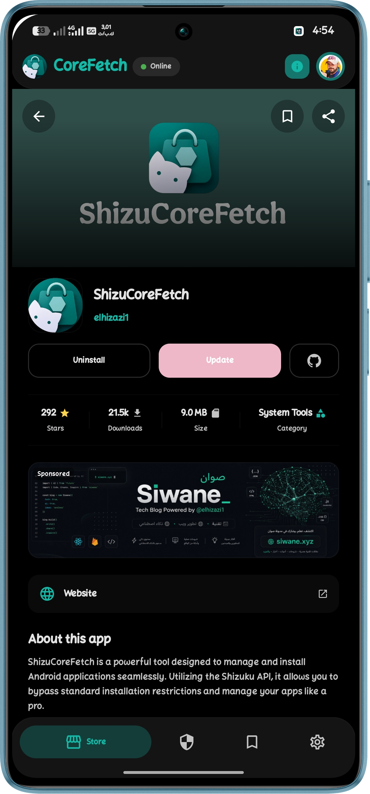
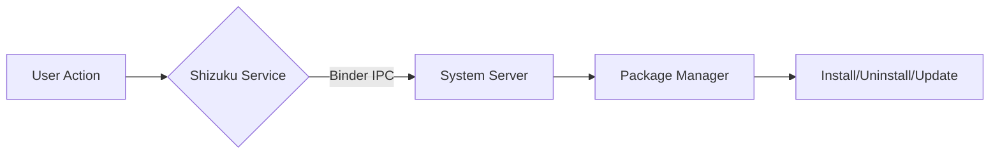

  

  # 🌟 Shizu CoreFetch 🌟
  
  **An advanced, Shizuku-powered application hub for Android.** 
  *Fetch, manage, and silently update your apps with system-level privileges — entirely open source.*

   

  <!-- Project Stats & License -->
  
  
  
  
  
    

  <!-- Tech Stack & Platform -->
  
  
  
  

    

  <!-- Community -->
  

 

---

## 📢 Attention Developers: Stand Out in the Store!

With Shizu CoreFetch rapidly expanding, now is the perfect time to optimize how your application is presented. Our smart store engine automatically scans for custom metadata. By simply adding a `shizu_store.json` file to the root of your repository, you can display elegant, tailored information, localized descriptions, and custom developer details directly inside our store. 

*Find the full documentation on how to structure your JSON file at the bottom of this page.*

---

## 📺 Featured On

  
We are incredibly proud to have <b>Shizu CoreFetch</b> discovered and reviewed by:

  
   
  <strong>HowToMen</strong> 
  <em>"Top 15 Best Shizuku Apps to Use in 2026!"</em>

 

<b>🌍 Click to see more amazing reviews from our global community</b>

 

- 🇪🇸 **[El Androide Feliz](https://youtu.be/NjFIz_oBKEs)** – *10 NUEVAS APKs para SHIZUKU que ponen tu Android al 100%*
- 🌍 **[TechyNoob](https://youtu.be/PMiUF1b26yY)** – *Top 3 Shizuku Apps to Unlock Android's True Power!*
- 🇲🇦 **[Mounir Tech](https://youtu.be/yiRi87Yieo8)** – *افضل 7 تطبيقات الجيل الجديد 2026 | تطبيقات شيزوكو*

---

## ✨ Next-Generation Features

<table>
  <tr>
    <td width="50%">
      🎯 <b>Smart App Matching</b> 
      A deep device scanner intelligently maps all apps directly from the repo tree without extra API calls. Action buttons are always 100% accurate.
    </td>
    <td width="50%">
      ⚡ <b>Persistent Background Engine</b> 
      Downloads and installations run on a standalone Foreground Service. Switch screens or minimize the app flawlessly.
    </td>
  </tr>
  <tr>
    <td>
      🎨 <b>Modern Compose UI</b> 
      Rebuilt from the ground up with Jetpack Compose and Material Design 3 for fluid shimmer animations and seamless screen transitions.
    </td>
    <td>
      🛡️ <b>Silent Operations</b> 
      Install, uninstall, and update apps directly at system level via Shizuku. Fully supports Root, Wireless Debugging, and Test-Only packages.
    </td>
  </tr>
  <tr>
    <td>
      ☁️ <b>Zero-Quota Architecture</b> 
      Browse and download seamlessly without hitting GitHub API rate limits. The smart cloud engine handles high traffic effortlessly.
    </td>
    <td>
      📦 <b>Local Storage Wallet</b> 
      Store downloaded APKs locally, share them via any app, or open them with external file viewers. Delete packages with a single tap.
    </td>
  </tr>
</table>

---

## 📱 A Stunning Experience

  
  
  

---

## 🧠 Architecture & Stack

Shizu CoreFetch uses the Shizuku Binder API to execute privileged commands directly on the Android package manager. The app itself runs without root, making it safe and compliant with modern Android security policies.

<b>🛠️ Click to view Technical Stack</b>

 

- **Language:** Kotlin
- **UI Architecture:** Jetpack Compose + Material Design 3 Components 
- **Networking:** Retrofit 2 + OkHttp + Java HttpURLConnection
- **Local Caching:** SharedPreferences Architecture (instant load cache)
- **Concurrency:** Native Kotlin Threads + DownloadForegroundService
- **Backend:** Google Apps Script + Google Sheets API (Smart package mapping)

---

## 🚀 Get Started

<b>📦 Installation Guide</b>

 

1. **Download the latest APK** from the [Releases page](https://github.com/elhizazi1/ShizuCoreFetch/releases/latest).
2. Install the APK on your Android device.
3. Open **Shizuku** and start the service (Root or Wireless ADB).
4. Launch **Shizu CoreFetch** and grant the Shizuku permission.
5. You’re all set! Browse and manage your packages silently.

<b>🌍 Supported Languages</b>

 

Available in 11 languages with automatic system language detection: العربية, English, Français, Español, Português, Русский, हिन्दी, 中文, 日本語, Türkçe, Čeština.

---

## 🤝 Community & Acknowledgments

We welcome contributions! Read our Contribution Guidelines for details on coding conventions. 

A massive thank you to our incredible open-source community! To everyone who has opened an issue, suggested a feature, or tested a release—thank you. (Individual credits for testing and feedback are always highlighted in our [Release Notes](https://github.com/elhizazi1/ShizuCoreFetch/releases)).

* **Turkish (Türkçe):** Translated by [AhmetCanArslan](https://github.com/AhmetCanArslan)
* **Czech (Čeština):** Translated by [Jakub K. (@kouzelnik3)](https://github.com/kouzelnik3)

---

## 📜 Documentation & Developer Integration

For complete documentation on every field, locale, and best practice, visit the official docs:  
**🔗 [https://docshizu.siwane.xyz/](https://docshizu.siwane.xyz/)**

You don't need to send anything or register. Just add a valid `shizu_store.json` file at the root of your repository!

---

  <b>Jamal El Hizazi</b> 
  <a href="https://github.com/elhizazi1">GitHub</a> • <a href="mailto:jamal@elhizazi.me">Email</a> • <a href="https://siwane.xyz">Website</a>
    
  
Made with ❤️ for the Android community

